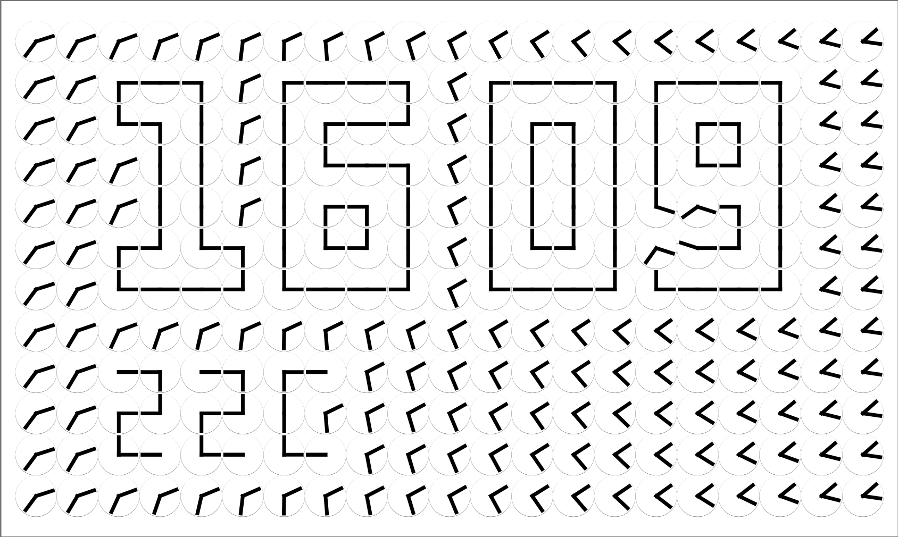
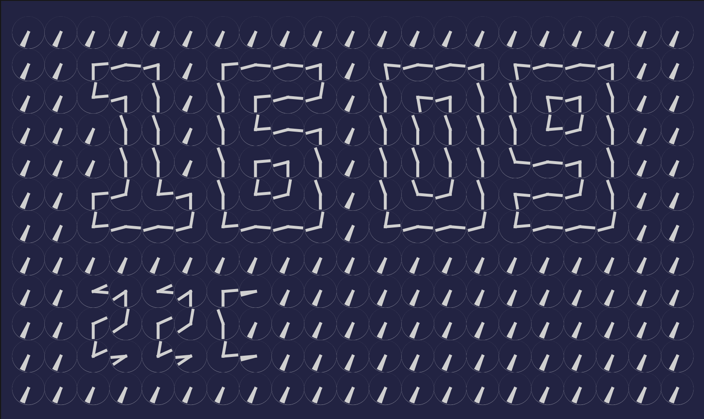

# Flutter Analog to Digital Clock
A clock written for the [Flutter Clock challenge](https://flutter.dev/clock).

The clock is a grid of analog clocks that animate to show a digital time and temperature. The clock repeats 6 minutes of transition animations. The design is inspired by the art work A Million Times by [Humans since 1982](https://www.humanssince1982.com/).

The clock supports the model settings: theme, temperature unit and hour format.

